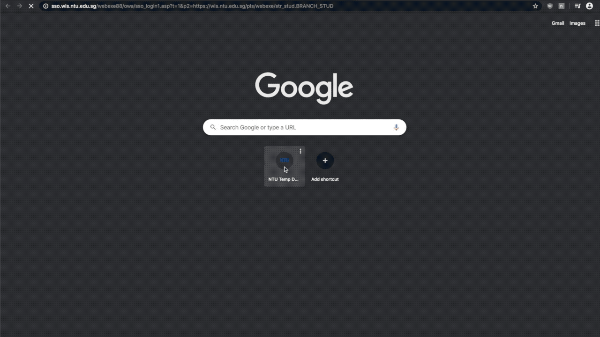
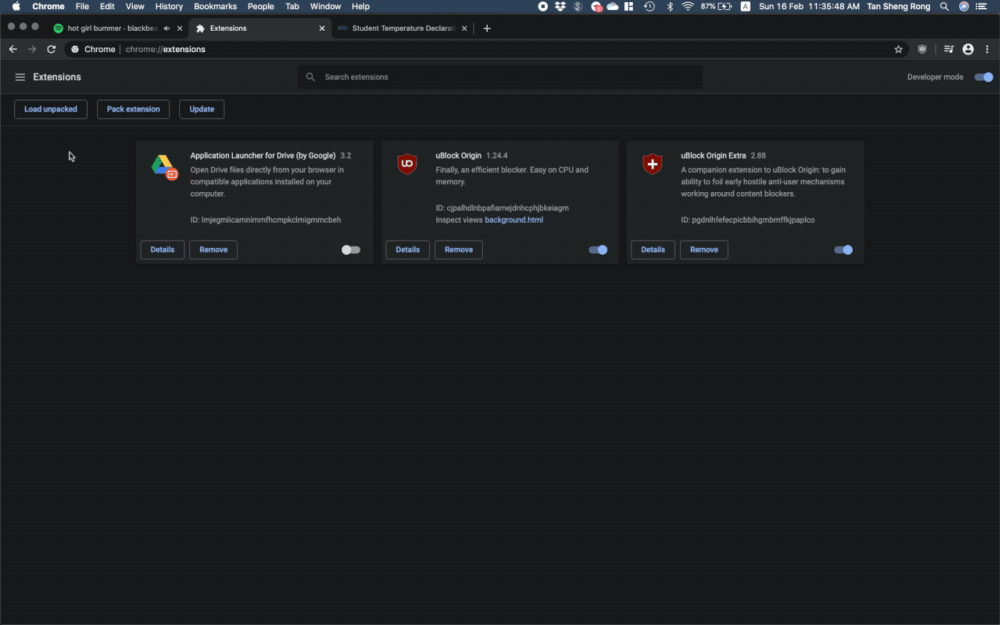

# ntu-sso-login
My chrome extension implementation of the automated SSO login, I don't particularly like to be redirected through two login pages. This is particularly so for the temperature declaration that we have to do during this DORSCON Orange due to COVID-19. Minutes lost for logging in twice a day!

Feel free to clone and fork, but do read the source code before you do, and understand how it works - keeping this unpacked so modification of the source code is easy.

# How it works
This is non-malicious: feel free to look at the source. The `ssoLogin` content script fills in the user_id and password fields with the values from the javascript file itself. By doing so, login is almost instantaneous. 

# Keep your credentials secure
Be careful of whom and what you share. Users should exercise extra caution when handling files containing credentials. This extension should really only be used by yourself. 

# Installation
Open `chrome://extensions` in Chrome, click `Load Unpacked` and navigate to your local copy of this directory.

# To-do 
- Automatic login when site is redirected to login page. Listens for a change in tab url and will run the appropriate content script ?
- `popupLogin` content script simply follows the SSO login link ? Only managed to bypass it by parsing user_id and password directly to the address bar (gg)
- Reading credentials from autofill such as Google Chrome password manager/Lasspass/Keychain for added security 

# Thanks

- [Original dev](https://github.com/joel-huang)