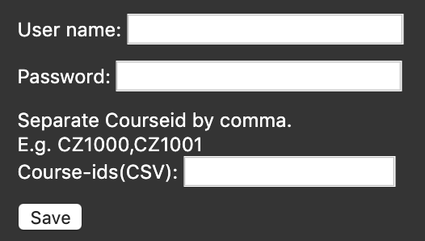

# NTU Login for Chrome and Firefox

# How

Credentials entered by the user in the extension's option page is stored locally in the browser. The extension detects **relevant NTU website** that requires login and inputs the credentials into DOM elements using Javascript. As INTU login uses ASPX login form, JS is unable to access the elements. Credentials are parsed onto the web address instead.

# Installation

Git clone this repository or head over to the [releases](https://github.com/TanShengRong/NTU-login-extension/releases/). 

#### Chrome

Open `chrome://extensions` in Chrome, click `Load Unpacked` and navigate to your local copy of the chrome extension directory.

#### Firefox

Drg the xpi file into firefox. 

#### Potential issues

- Changes in the web addresses for NTU login

### Special thanks

- [SUTD sso login](https://github.com/joel-huang/edimension-sso-login)
